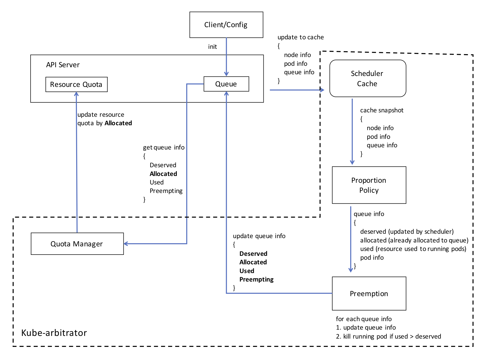

# Queue API

@k82cn, 9/16/2017

## Overview

[Resource sharing architecture for batch and serving workloads in Kubernetes](https://docs.google.com/document/d/1-H2hnZap7gQivcSU-9j4ZrJ8wE_WwcfOkTeAGjzUyLA/edit#) proposed
`QueueJob` feature to run batch job with services workload in Kuberentes. Considering the complexity, the 
whole batch job proposal was seperated into two phase: `Queue` and `QueueJob`. This document 
presents the API deinition of `Queue` for MVP.

### Scope

  * In MVP, the resource request of `QueueJob` are ignored
  * In MVP, the policy allocates resource based on `Queue`'s configuration
  * In MVP, `Queue` is namespace level

## Terminology

  * Deserved (Resource): The total number of resources that the arbitrator allocated to the namespace
  * Overused: The namespace is overused if it used more resources than deserved resources
  * Underused: The namespace is underused if it used less resource than deserved resources

## API

```go
type Queue struct {
    metav1.TypeMeta   `json:",inline"`
    metav1.ObjectMeta `json:"metadata"`

    Spec QueueSpec
    Status QueueStatus
}

type QueueSpec struct {
    metav1.TypeMeta   `json:",inline"`
    metav1.ObjectMeta `json:"metadata"`

    // The weight of Queue, which is used by policy to allocatre resource; the 
    // default value is 1. NOTE: it can not expect allocating more resouce with 
    // higher weithg, it dependent on policy's reaction to the weight.
    Weight int
}

type QueueStatus struct {
    metav1.TypeMeta   `json:",inline"`
    metav1.ObjectMeta `json:"metadata"`

    // The deserved resource of Queue according to the policy
    Deserved    ResourceList
    // The resources that allocated to Queue, the allocated resource is less or 
    // equal to `Deserved`:
    //   * if some resource was preempting, the Allocated is less then Deserved
    //   * otherwise, Allocated equals to Deserved
    Allocated   ResourceList
    // The resource that used by Pod in namespace; if more resource was used than 
    // Deserved, the overused resource will be preempted.
    Used        ResourceList
}
```

## Function Detail

### Workflow


### Admission Controller

### Quota Manager
Only Quota Manager can update Resource Quota. And it has two responsibility:

* Periodically query Queue status which contains allocated resources information from API server. Status struct is defined as `QueueStatus`
* Update `Deserved` infomation in `QueueStatus` into Resource Quota

### Scheduler Cache

Scheduler Cache periodically fetch all Node/Pod/Queue information in cluster from API server. Those inforamtion will only be stored in memeory and not persisted in disk.

It provides two interfaces `Run()` and `Dump()`

* `Run()` to trigger cache to periodically fetch Node/Pod/Queue information from API server
* `Dump()` create `CacheSnapshot ` for policy

```go
type Cache interface {
	// trigger cache to fetch Node/Pod/Queue 
	// information periodically from API server
	Run(stopCh <-chan struct{})

	// Dump deep copy overall Node/Pod/Queue information into CacheSnapshot
	Dump() *CacheSnapshot
}

type CacheSnapshot struct {
	Pods       []*PodInfo
	Nodes      []*NodeInfo
	Queues     []*QueueInfo
}
```

### Proportion Policy

The policy summary usable resources(cpu and memory) on all nodes and allocate them to each Queue by `Weight` in `QueueSpec` simply. `Pods` is not used in policy, it is for preemption in next step.

```
CacheSnapshot information:
------------------    ------------------ 
| Node-1         |    | Node-2         | 
|   cpu: 6       |    |   cpu: 3       | 
|   memory: 15Gi |    |   memory: 12Gi | 
------------------    ------------------ 
---------------    ---------------
| Queue-1     |    | Queue-2     |
|   Weight: 2 |    |   Weight: 4 |
---------------    ---------------

After policy scheduling:
--------------------    ---------------------
| Queue-1          |    | Queue-2           |
|    Weight: 2     |    |    Weight: 4      |
|                  |    |                   |
|    Deserved:     |    |    Deserved:      |
|      cpu: 3      |    |      cpu: 6       |
|      memory: 9Gi |    |      memory: 18Gi | 
--------------------    ---------------------
```

Policy format scheduler result as `ScheduledQueueInfo`, and transfer to Preemption for next step.

```go
type ScheduledQueueInfo struct {
	// policy shceduling result
	Deserved    ResourceList
	// the last Deserved
	Allocated   ResourceList
	// all resources used by running pod in Pods
	Used        ResourceList
	// all pod inforamtion under this queue
	Pods        []*PodInfo
}
```

### Preemption

Preemption is used to reclaim resource for overused queue. It is responsible for two things for each `ScheduledQueueInfo`:

* Update Queue
* Kill running pods if needed

Details of preemption

* Update `Deserved` `Allocated` in `ScheduledQueueInfo` into Queue for those `ScheduledQueueInfo` which `Deserved` < `Allocated`
* Kill running pods in `Pods` in `ScheduledQueueInfo` if it is overused(`Used` > `Deserved`). Preemption will kill a running pod randomly and then check if `Used` <= `Deserved`. If not, kill a running pod randomly and check again. "Randomly" is not a efficient way to choose pod, need improve this later.
* Update Update `Deserved` `Allocated` in `ScheduledQueueInfo` into Queue for those `ScheduledQueueInfo` which `Deserved` >= `Allocated`

```
Take following queue as a sample for killing pod
--------------------------------------------------------------------------
| Queue-1                                                                |
|    Weight: 2                                                           |
|                                                                        |
|    Deserved:         Used:                Pods:                        |
|      cpu: 3            cpu: 6               pod-1: cpu=2 memory=4Gi    |
|      memory: 9Gi       memory: 12Gi         pod-2: cpu=4 memory=8Gi    |
--------------------------------------------------------------------------

Preemption choose a pod randomly to kill, such as pod-2 is chosen, now Queue-1 
--------------------------------------------------------------------------
| Queue-1                                                                |
|    Weight: 2                                                           |
|                                                                        |
|    Deserved:         Used:                Pods:                        |
|      cpu: 3            cpu: 2               pod-1: cpu=2 memory=4Gi    |
|      memory: 9Gi       memory: 4Gi                                     |
--------------------------------------------------------------------------
It is underused now (Used < Deserved), preemption for Queue-1 is done.

It is possible that pod-1 is chosen to kill, Queue-1 is still overused, then pod-2 will be killed by Preemption. This may happen when pod is chosen randomly, this is not a good policy.
```
