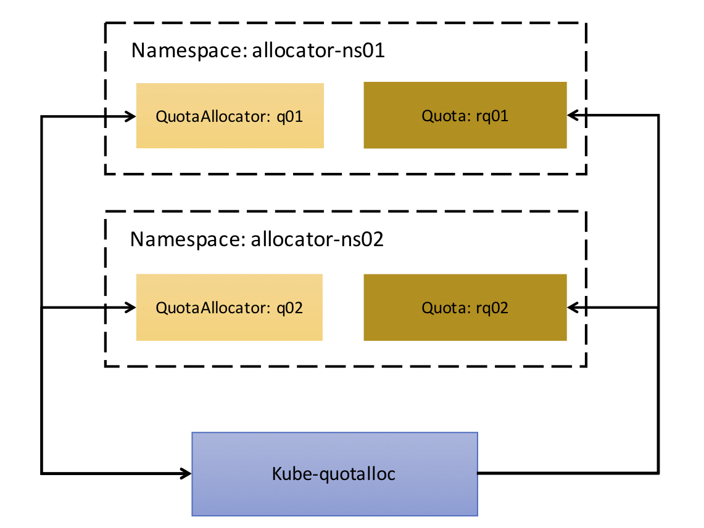

# Tutorial of Kube-quotalloc

This doc will show the tutorial of Kube-quotalloc.

## 1. Pre-condition
To run `Kube-quotalloc`, a kubernetes cluster must start up. Here is a document [Using kubeadm to Create a Cluster](https://kubernetes.io/docs/setup/independent/create-cluster-kubeadm/)

## 2. Create QuotaAllocator CRD
`QuotaAllocator` is a kubernetes CRD [(custom resources definition)](https://kubernetes.io/docs/tasks/access-kubernetes-api/extend-api-custom-resource-definitions/). Following is the yaml file of QuotaAllocator CRD and it must be created before `Kube-quotalloc` startup.

```yaml
apiVersion: apiextensions.k8s.io/v1beta1
kind: CustomResourceDefinition
metadata:
  name: quotaallocators.arbitrator.incubator.k8s.io
spec:
  group: arbitrator.incubator.k8s.io
  names:
    kind: QuotaAllocator
    listKind: QuotaAllocatorList
    plural: quotaallocators
    singular: quotaallocator
  scope: Namespaced
  version: v1
```

Verify quotaallocator crd after creation 

```
# kubectl get crd
NAME                                          AGE
quotaallocators.arbitrator.incubator.k8s.io   7m
```

## 3. Create QuotaAllocator
After creating `QuotaAllocator` CRD, need to create quotaallocators for resource allocation. A quotaallocator is like a tenant and includes resource request information. `Kube-quotalloc` will allocate cluster resources between different quotaallocators. Following is yaml template of `QuotaAllocator`:

```
apiVersion: "arbitrator.incubator.k8s.io/v1"
kind: QuotaAllocator
metadata:
  name: xxx
  namespace: xxx
spec:
  weight: xxx
  request:
    resources:
      cpu: "xxx"
      memory: xxxGi
```

* `name`: name of this quotaallocator.
* `namespace`: namespace of this quotaallocator, resources will be allocated to this namespace by `Kube-quotalloc`. The quotaallocator must belong to a namespace and a namespace has one quotaallocator at most. So it is namespace level resource allocation. Fine-grained scheduling will be support in future. Refer [Fine-grained scheduling](#future1) for more details. 
* `weight`: weight of this quotaallocator, it must be an integer. The high weight quotaallocator will get more resources.
* `request`: the total resource request of this quotaallocator, it contains CPU and Memory. CPU must be integer now. **This field is not supported by `Kube-quotalloc` yet**. It will be enhanced to support DRF. Refer [Resource request](#future2) for more details.

For example, create two quotaallocators like following, `q01` in namespace `allocator-ns01`, `q02` in namespace `allocator-ns02`

```
# kubectl get quotaallocators --all-namespaces
NAMESPACE        NAME      AGE
allocator-ns01   q01       15m
allocator-ns02   q02       15m
```
```
# cat allocator01.yaml
apiVersion: "arbitrator.incubator.k8s.io/v1"
kind: QuotaAllocator
metadata:
  name: q01
  namespace: allocator-ns01
spec:
  weight: 3
  request:
    resources:
      cpu: "5"
      memory: 6Gi
```
```
# cat allocator02.yaml
apiVersion: "arbitrator.incubator.k8s.io/v1"
kind: QuotaAllocator
metadata:
  name: q02
  namespace: allocator-ns02
spec:
  weight: 5
  request:
    resources:
      cpu: "6"
      memory: 7Gi
```

`Kube-quotalloc` will allocate resources to the two quotaallocators `q01` and `q02` according to their weight.

## 4. Create Resource Quota
After creating quotaallocators, then need to create resource quota for each quotaallocator. The resource quota must be under the same namespace as the quotaallocator. There is one resource quota under a namespace at most.
To support [Fine-grained scheduling](#future1), `Kube-quotalloc` needs to some new quota of QuotaAllocator/Job for resource limitation. Refer [New quota for QuotaAllocator/Job](#future3) for more details.

For example, create two quotas like following:

```
# kubectl get quota --all-namespaces
NAMESPACE        NAME     AGE
allocator-ns01   rq01     26m
allocator-ns02   rq02     26m
```
```
# cat resource-quota01.yaml 
apiVersion: v1
kind: ResourceQuota
metadata:
  name: rq01
  namespace: allocator-ns01
spec:
  hard:
    pods: "100"
    limits.cpu: "0"
    limits.memory: "0"
    requests.cpu: "0"
    requests.memory: "0"
```
```
# cat resource-quota02.yaml 
apiVersion: v1
kind: ResourceQuota
metadata:
  name: rq02
  namespace: allocator-ns02
spec:
  hard:
    pods: "100"
    limits.cpu: "0"
    limits.memory: "0"
    requests.cpu: "0"
    requests.memory: "0"
```

We can see that resources limitation(CPU and memory) is 0 now. `Kube-quotalloc` will change resource limitation of related quota after allocating resource to each quotaallocator.

## 5. Start kube-quotalloc
Download kube-arbitrator to `$GOPATH/src/github.com/kubernetes-incubator/` from github `https://github.com/kubernetes-incubator/kube-arbitrator`

Build kube-quotalloc:

```
# cd $GOPATH/src/github.com/kubernetes-incubator/kube-arbitrator
# make
```

Start kube-quotalloc:

```
# ./_output/bin/kube-quotalloc --kubeconfig /root/.kube/config
```

`--kubeconfig` must be set to specify the kubernetes configuration file.

Now we can see resource limitation of quota is changed. As mentioned above, `Kube-quotalloc` allocates resources to each quotaallocator(namespace) according to the weight in a quotaallocator.

```
# kubectl get quota rq01 -n allocator-ns01 -o yaml
... ...
spec:
  hard:
    limits.cpu: "6"
    limits.memory: "18919466496"
    pods: "100"
    requests.cpu: "6"
    requests.memory: "18919466496"
... ...
```
```
# kubectl get quota rq02 -n allocator-ns02 -o yaml
... ...
spec:
  hard:
    limits.cpu: "10"
    limits.memory: "31532444160"
    pods: "100"
    requests.cpu: "10"
    requests.memory: "31532444160"
... ...
```

## 6. Current structure


# Future work of kube-quotalloc
## <span id="future1">1. Fine-grained scheduling</span>
`Kube-quotalloc` only supports allocating resources to quotaallocator(namespace) level now. To do fine-grained scheduling, a quotaallocator can contain multiple jobs, **a job can be a batch job, big data job(Spark, Hadoop, etc), or custom definition job**. All the jobs in the same quotaallocator will share quotaallocator resources and `Kube-quotalloc` can allocate those resources to each job by some strategy. In the roadmap, `Kube-quotalloc` will support Job level resource allocation, [Issue 71: Queue job level resources assignment](https://github.com/kubernetes-incubator/kube-arbitrator/issues/71) is logged to trace the discussion.

## <span id="future2">2. Resource request</span>
A quotaallocator/job just include the total resource request now. Only CPU and Memory are supported. Other types of resources will be included, such as volume, etc.
In most cases, customer just want to define a `resource unit`, all tasks belongs to the same quotaallocator/job request the same resource unit. `Kube-quotalloc` will support to define resource unit and total request number in quotaallocator/job and allocate resource to quotaallocator/job by DRF.

## <span id="future3">3. New quota for QuotaAllocator/Job</span>
`Kube-quotalloc` uses ResourceQuota to limit resource usage of each quotaallocator, it is namespaces level. In the roadmap, `Kube-quotalloc` needs to add new Quota and admission control for QuotaAllocator and Job to limit resource usage. It may be as follows:

* `AllocatorQuota`: resource usage limitation of a QuotaAllocator
* `JobQuota`: resource usage limitation of a Job
* `AllocatorQuotaController`: new admission controller for AllocatorQuota
* `JobQuotaController`: new admission controller for JobQuota

[Issue 91](https://github.com/kubernetes-incubator/kube-arbitrator/issues/91) is logged to trace the discussion.